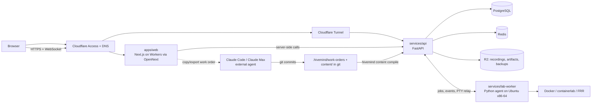

# HiveMind Architecture

Status: target architecture as of 2026-09-08, reflecting `DECISIONS.md` D-001 to D-029.
The repository is mid-transition from a Cloudflare-only scaffold to this design (see
"Transition from the scaffold"). Read `DECISIONS.md` first; this document explains how the
decisions fit together, not why they were made.

## Topology

## Components and ownership

| Component                | Language         | Owns                                                                                                                                              | Never does                                                              |
| ------------------------ | ---------------- | ------------------------------------------------------------------------------------------------------------------------------------------------- | ----------------------------------------------------------------------- |
| `apps/web`               | TypeScript       | Rendering, navigation, xterm/Monaco/topology views, work-order copy/export UI                                                                     | Business rules, grading, mastery math                                   |
| `services/api`           | Python (FastAPI) | Contracts, Postgres schema, lifecycle state machines, mastery/readiness algorithms, content compiler, work orders, review queues, WebSocket relay | Executing learner code, calling AI unless an API executor is configured |
| `services/lab-worker`    | Python           | Providers (`container.linux`, `network.containerlab`, `runtime.python`), PTY sessions, fault injection, grader execution, snapshots, cleanup      | Holding durable state; deciding mastery                                 |
| `packages/hivemind-core` | Python           | Pydantic contracts, versioning helpers, seed/variation utilities, redaction                                                                       | Framework code                                                          |
| `content/`               | YAML/MDX         | Skills registry, courses, sources, role profiles, problem archetypes, faults, graders' declarative parts                                          | Runtime code that bypasses contracts                                    |
| Cloudflare               | —                | DNS, Access (identity), Tunnel (ingress), Workers (frontend), R2 (blobs, backups)                                                                 | Control plane state, lab execution                                      |

Data ownership: PostgreSQL is the single durable source for learner, content index,
attempts, mastery, readiness, work orders, review items. Redis holds queues, presence, and
short-lived session coordination only. R2 holds terminal recordings (90-day TTL unless
pinned), lab artifacts, exports, and database backups. Git holds content and work orders;
the compiler loads them into Postgres.

## Core flows

**Launch a lab.** Browser → API `POST /labs/sessions {problem_ref, seed?}` → API creates
`lab_sessions` row (`queued`), enqueues a provision job → worker claims it, instantiates the
ProblemSpec with the seed, provisions via the provider, runs baseline check, injects fault,
verifies fault, reports `ready` with node list → API streams status events over the
session WebSocket → browser opens terminal tabs; PTY frames are relayed API ↔ worker ↔
container. Lifecycle states are RFP §86 verbatim.

**Submit.** Browser → API `POST /labs/sessions/{id}/submit` → worker runs the versioned
grader against final state → `GradeResult` (deterministic) persisted on an immutable
`attempts` row → mastery update computed by the versioned algorithm → optional AI
methodology review produced as an External Work Order prompt (default) or via an API
executor → session destroyed, recording finalized to R2 with redaction applied.

**Author content.** Jacob opens a work order in the web UI (or `hivemind work new`) →
structured YAML + human prompt written to `.hivemind/work-orders/` → Claude Code executes it
in the repo, producing content files, tests, and a change report → `hivemind work validate`
runs schema checks and, for problems, the RFP §46 pipeline on the worker → review item
appears in Jacob's queue → approve → `hivemind content compile` publishes a new content
version. Published content is immutable per version.

**Maintenance.** Same mechanism in batches: the API computes what is due (stale role
profiles, source health, lab regressions) and emits a batch work order; Claude Code runs
it; results and change reports are imported.

## Contracts (source of truth: `packages/hivemind-core`)

- Skill registry: `SkillDefinition` (id, version, prerequisites, objectives, mastery
  criteria, misconceptions). Global, referenced by courses, roles, certifications.
- Course package: `CourseManifest`, `Module`, `Lesson` (MDX plus metadata, QA state,
  provenance claims), semantic version.
- Capabilities: dotted ids (`container.linux`, `network.containerlab`, `runtime.python`).
  Courses request; providers satisfy.
- `LabProvider` interface: provision, baseline_check, inject_fault, verify_fault,
  open_pty, snapshot, run_grader, destroy. Implemented by the worker.
- `ProblemSpec` and `ProblemInstance`: archetype + faults + objectives + difficulty; an
  instance is seed + generator/course/topology/fault/grader versions + spec hash.
- `Grader` contract: versioned, final-state checks, returns `GradeResult` with per-objective
  outcomes and evidence.
- `Attempt`, `Evidence`, `MasteryUpdate`: immutable rows; algorithm version recorded.
- `RoleProfile`, `Competency`, `Readiness`: D-002 hierarchy with hard-requirement gates and
  confidence.
- `WorkOrder`, `ReviewItem`: D-009 and D-004.

TypeScript types are generated from these (D-027). Wire formats are versioned; breaking
changes bump the contract version and ship migrations.

## Security model (single learner, D-001)

- Identity: Cloudflare Access in front of both the web app and the API hostname. The API
  validates the Access JWT and maps to the seeded `learner_id`.
- Worker reachability: only via Tunnel or a private network; no public ports.
- Labs protect the host from accidents: per-lab cgroup limits (CPU, memory, pids, disk),
  no host Docker socket inside labs, dedicated Docker networks per session, default-deny
  egress with an explicit allowlist, orphan sweeper on the worker, hard TTL per session.
- Recordings: redaction filter for tokens, passwords, private keys before storage; 90-day
  TTL; pinning is explicit.
- Secrets: Cloudflare and host secret stores only; never in content or work orders.

## Durability (D-020)

Nightly logical backups of PostgreSQL to R2 with retention; `hivemind export` produces a
portable archive of learner history and approved content; a scripted restore drill
(destroy database → restore → smoke test) is part of Stage 1 acceptance and rerun each
stage milestone. Lab workers hold nothing that cannot be rebuilt from git plus Postgres.

## Environments and deployment

`dev` (local Next dev against a dev API; worker may be the rented host), `production`
(Workers + Tunnel + host). Deploy order: API migrations → API → worker → web. Cloudflare
Workers deploy via the existing OpenNext tooling; API and worker deploy as containers on
the host via a small compose or systemd setup defined in Stage 1/2.

## Transition from the scaffold

Kept: `apps/web` (Next 16 on OpenNext, app shell, tooling), Cloudflare plumbing, deploy
script shape, lint/format/test setup. Removed in Stage 1 (D-026): `apps/realtime-worker`
and its Durable Object, the D1 binding and `migrations/`, `packages/protocol` (replaced by
generated types), the placeholder pages and the demo labs UI (replaced by Stage 1 Learn and
Stage 4 workspace). The lifecycle/deadline-queue design from the Durable Object is carried
into the Python state machine.

## Open points

- D-029 PostgreSQL placement.
- Whether `apps/web` stays on Workers or moves next to the API behind the Tunnel (keep on
  Workers unless server-side calls to the API become the bottleneck).
- Topology renderer choice (React Flow vs Cytoscape) — decide in Stage 4 with wireframes.
