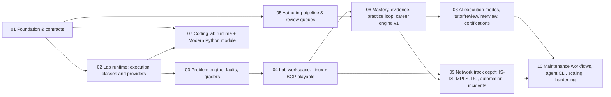

# HiveMind Stages

Each `STAGE_nn.md` is a self-contained work contract. A fresh Claude Code context should be
able to execute a stage given only: `CLAUDE.md` → `AGENTS.md`, `DECISIONS.md`,
`ARCHITECTURE.md`, `docs/RFP.md`, and the stage file. Every stage file follows the D-022
contract (twenty sections, same order).

## How to start a stage

```text
Execute STAGES/STAGE_02.md. Read CLAUDE.md, DECISIONS.md, ARCHITECTURE.md, and the
prerequisite stage files first. Do not begin until the "Open questions" in the stage file
are resolved with Jacob.
```

## Order and dependencies (D-021: contracts before parallel work)



After Stage 1 stabilizes the contracts, Stages 2 and 5 may run in separate contexts; after
Stage 3, Stage 7 may run alongside Stage 4. Stages 6, 8, 9, 10 are sequential on their
inputs.

## Status

| Stage | Name                                                       | Status      | Milestone commit/tag |
| ----- | ---------------------------------------------------------- | ----------- | -------------------- |
| 01    | Foundation and contracts                                   | not started |                      |
| 02    | Lab worker runtime                                         | not started |                      |
| 03    | Problem engine, faults, graders, validation                | not started |                      |
| 04    | Lab workspace and guided/challenge modes                   | not started |                      |
| 05    | Authoring pipeline and review queues                       | not started |                      |
| 06    | Mastery, evidence, practice loop, career engine v1         | not started |                      |
| 07    | Coding lab runtime and Modern Python module                | not started |                      |
| 08    | AI execution modes, tutor/review/interview, certifications | not started |                      |
| 09    | Network track depth and incident response                  | not started |                      |
| 10    | Maintenance workflows, agent CLI, scaling, hardening       | not started |                      |

Update this table and the stage file's "Definition of done" checklist at each milestone.
